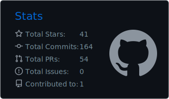
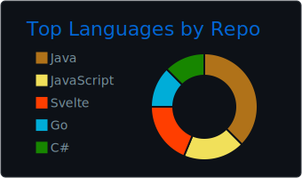
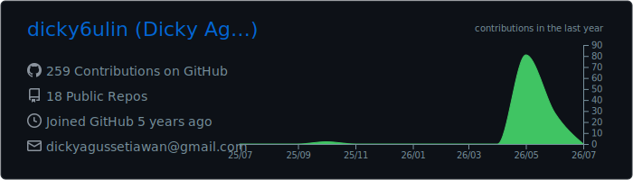

<div align="center">

[](https://git.io/typing-svg)

<br/>


</div>

<br/>

## `> whoami`

```text
Name     : Dicky A. Setiawan
Role     : Software Engineer
Location : Jakarta, Indonesia
Focus    : .NET / C# · Backend Systems · Enterprise Solutions
Stack    : .NET & React.js specialist, polyglot in Java, Go, Python & PHP
```

> *Specialized in building robust, scalable systems with .NET and C#.*
> *Focused on clean architecture, performance optimization, and delivering real business value through code.*

<br/>

## `> tech --stack`

<div align="center">

#### 🔧 Languages


#### ⚡ Frameworks & Libraries


#### 🗄️ Databases


#### 🛠️ Tools & Platform


</div>

<br/>

## `> stats --github`

<div align="center">


&nbsp;&nbsp;


<br/><br/>



<br/><br/>

<a href="https://github.com/dicky6ulin">
  
</a>

<br/><br/>

<a href="https://github.com/dicky6ulin">
  
</a>

</div>

<br/>

## `> connect`

<div align="center">

<a href="https://www.linkedin.com/in/dicky-agus-setiawan/">
  
</a>
&nbsp;&nbsp;
<a href="mailto:dickyagussetiawan@gmail.com">
  
</a>

</div>

<br/>

<div align="center">

```
✨ "Menuju Tak Terbatas dan Melampauinya" — Buzz Lightyear ✨
```

</div>


